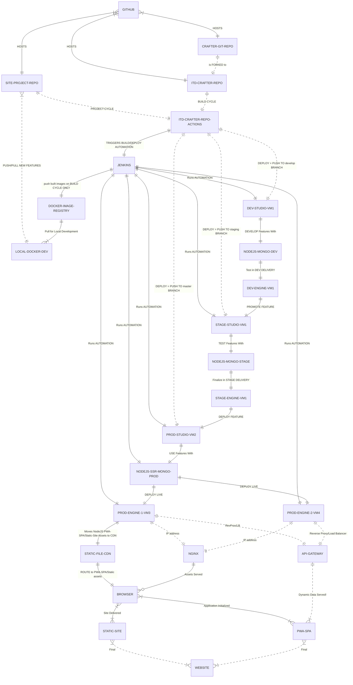

# Crafter Software & Site Deployments

```mermaid
erDiagram
        GITHUB }|--|| CRAFTER-GIT-REPO : HOSTS
        GITHUB }|--|| ITD-CRAFTER-REPO : HOSTS
        GITHUB }|--|| SITE-PROJECT-REPO : HOSTS
        CRAFTER-GIT-REPO ||..|| ITD-CRAFTER-REPO : "is FORKED to"
        SITE-PROJECT-REPO }|..|| LOCAL-DOCKER-DEV : "PUSH/PULL NEW FEATURES"
        SITE-PROJECT-REPO ||..|| ITD-CRAFTER-REPO-ACTIONS : "PROJECT CYCLE"
        ITD-CRAFTER-REPO ||..|| ITD-CRAFTER-REPO-ACTIONS : "BUILD CYCLE"
        ITD-CRAFTER-REPO-ACTIONS ||--|| JENKINS : "TRIGGERS BUILD/DEPLOY AUTOMATION"
        JENKINS ||--|| DOCKER-IMAGE-REGISTRY : "push built images on BUILD CYCLE ONLY"
        JENKINS ||--|| DEV-STUDIO-VM1 : "Runs AUTOMATION"
        JENKINS ||--|| STAGE-STUDIO-VM1 : "Runs AUTOMATION"
        JENKINS ||--|| PROD-STUDIO-VM2 : "Runs AUTOMATION"
        JENKINS ||--|| NODEJS-SSR-MONGO-PROD : "Runs AUTOMATION"
        JENKINS ||--|| PROD-ENGINE-1-VM3 : "Runs AUTOMATION"
        JENKINS ||--|| PROD-ENGINE-2-VM4 : "Runs AUTOMATION"
        DOCKER-IMAGE-REGISTRY ||--|{ LOCAL-DOCKER-DEV : "Pull for Local Development"
        ITD-CRAFTER-REPO-ACTIONS ||..|| DEV-STUDIO-VM1 : "DEPLOY = PUSH TO develop BRANCH"
        ITD-CRAFTER-REPO-ACTIONS ||..|| STAGE-STUDIO-VM1 : "DEPLOY = PUSH TO staging BRANCH"       
        ITD-CRAFTER-REPO-ACTIONS ||..|| PROD-STUDIO-VM2 : "DEPLOY = PUSH TO master BRANCH"
        DEV-STUDIO-VM1 ||--|| NODEJS-MONGO-DEV : "DEVELOP Features With"
        NODEJS-MONGO-DEV ||--|| DEV-ENGINE-VM1 : "Test in DEV DELIVERY"
        DEV-ENGINE-VM1 ||--|| STAGE-STUDIO-VM1 : "PROMOTE FEATURE"
        STAGE-STUDIO-VM1 ||--|| NODEJS-MONGO-STAGE : "TEST Features With"
        NODEJS-MONGO-STAGE ||--|| STAGE-ENGINE-VM1 : "Finalize in STAGE DELIVERY"
        STAGE-ENGINE-VM1 ||--|| PROD-STUDIO-VM2 : "DEPLOY FEATURE"
        PROD-STUDIO-VM2 ||--|| NODEJS-SSR-MONGO-PROD : "USE Features With"
        NODEJS-SSR-MONGO-PROD ||--|| PROD-ENGINE-1-VM3 : "DEPLOY LIVE"
        NODEJS-SSR-MONGO-PROD ||--|| PROD-ENGINE-2-VM4 : "DEPLOY LIVE"
        PROD-ENGINE-1-VM3 ||..|| NGINX : "IP address"
        PROD-ENGINE-2-VM4 ||..|| NGINX : "IP address"
        PROD-ENGINE-1-VM3 ||--|| STATIC-FILE-CDN : "Moves NodeJS PWA-SPA/Static-Site Assets to CDN"
        STATIC-FILE-CDN ||--|| BROWSER : "ROUTE to PWA-SPA/Static assets" 
        PROD-ENGINE-1-VM3 ||..|| API-GATEWAY : "RevProx/LB"
        PROD-ENGINE-2-VM4 ||..|| API-GATEWAY : "Reverse Proxy/Load Balancer"
        NGINX ||--o{ BROWSER : "Assets Served"
        BROWSER }|--|{ STATIC-SITE : "Site Delivered"
        BROWSER }|--|{ PWA-SPA : "Application Initialized"
        API-GATEWAY ||..|{ PWA-SPA : "Dynamic Data Served!"
        STATIC-SITE }|..|{ WEBSITE : Final
        PWA-SPA }|..|{ WEBSITE : Final
```
					