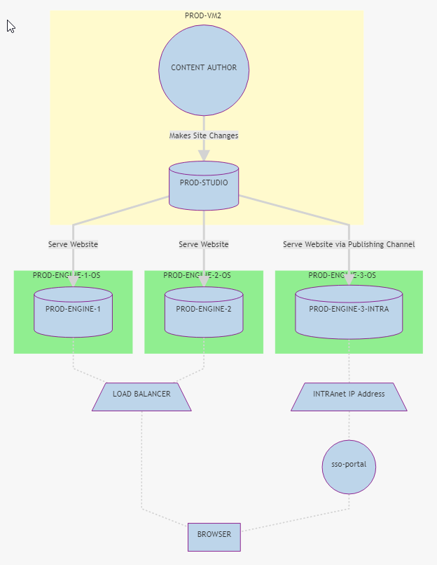
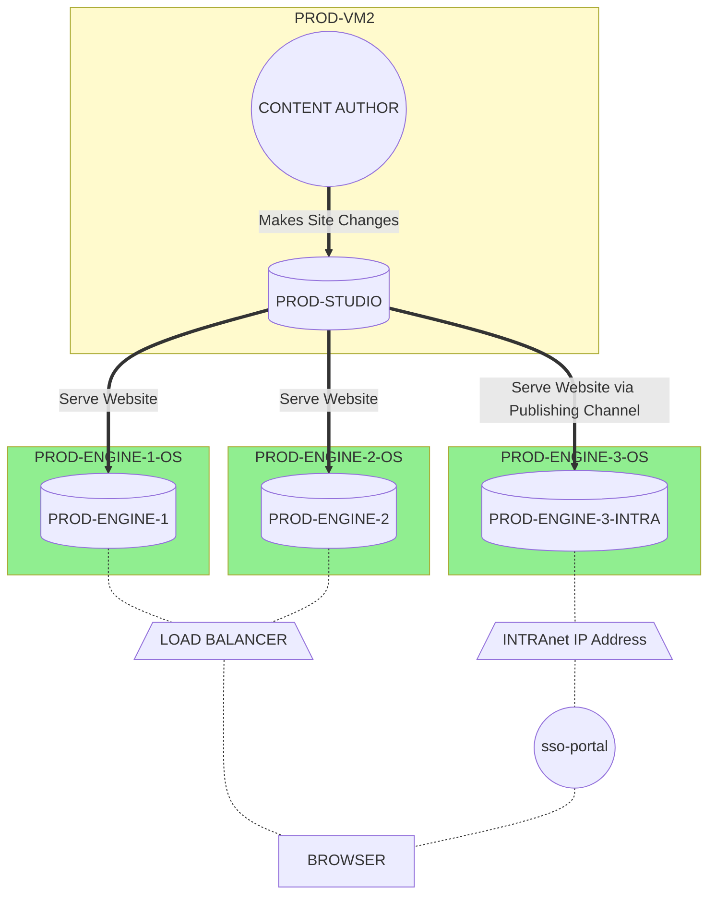
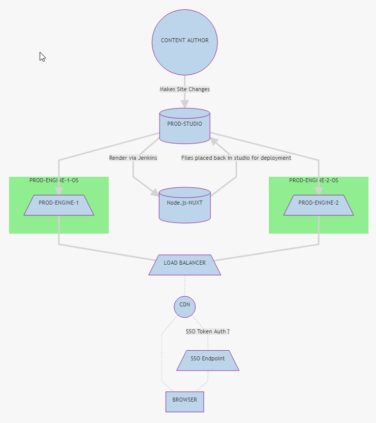
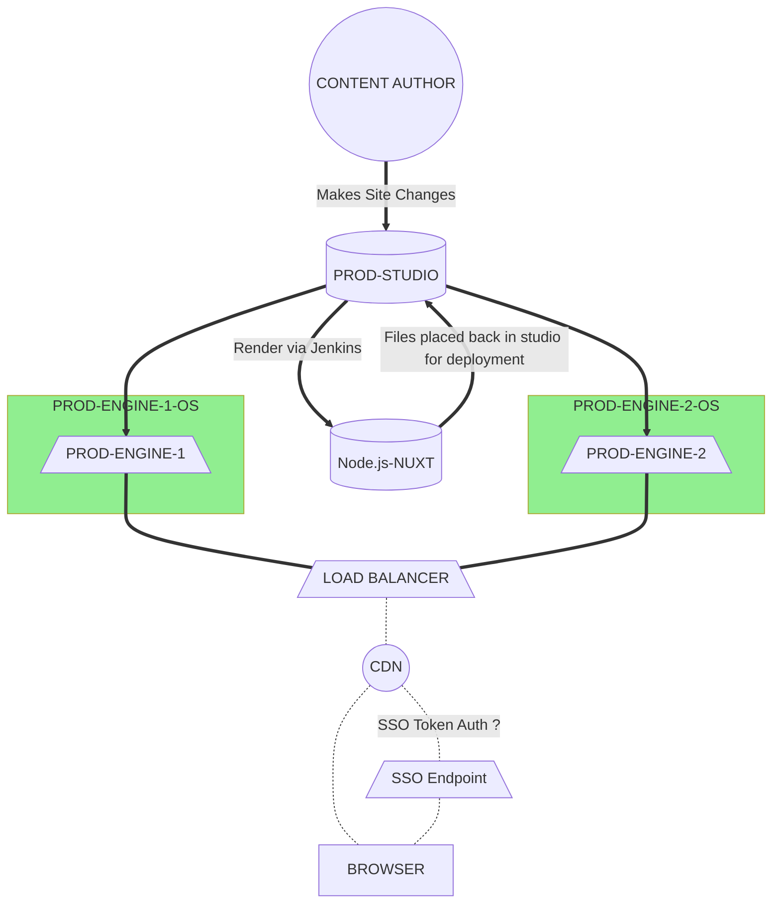
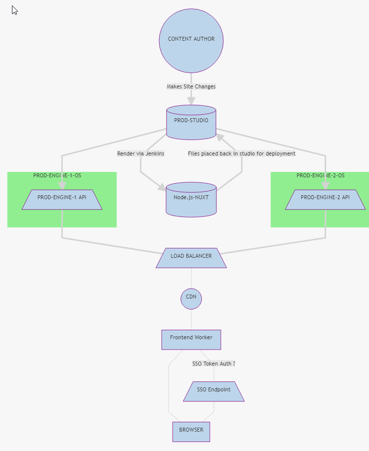
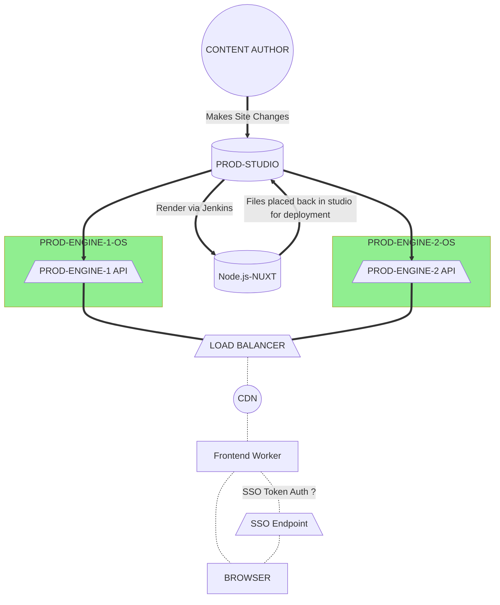

# CrafterCMS/ITD Architecture Docs

## Front-end Architecture Options
**Brief** - Below are couple of options we have for deciding how to serve the websites from Crafter CMS.
Some of the thinking for this derives from certain front-end delivery architecture patterns that all have their pros & cons. Ultimately deciding how to render ones website can have big architectural implications and so considering each and knowing our options helps when we go to decide on certain future system features.

You can read more about these website delivery patterns here.

* [Rendering on the Web](https://developers.google.com/web/updates/2019/02/rendering-on-the-web)

### Delivery Direct
#### Pros
- Easy out of the Box setup
- Able to leverage FTL templates from migrated sites
- Easy Templating
- Good Support out of the box.

#### Cons
- Lack of Frontend Control needed
- Lacks quick configuration of PostCSS tools
- Limited javascript API without Node
- Analytics more difficult to configure, manage, integrate
- Does not Separate concerns as well. (Backend + Frontend)
- Might cost more $$$ having to spin up a separate environment just for **INTRAnet**.
- Maintainance of Two traffic endpoints (Public LB and Internal LB or IP) instead of ONLY load balancing.
- Potentially more VM's to setup and maintain

**NOTE** - The below code can be pasted into [Mermaid Live Editor](https://mermaid-js.github.io/mermaid-live-editor/) to be viewed or manipulated.

### Server Side Rendering with Nuxt
- See [Server Rendering](https://developers.google.com/web/updates/2019/02/rendering-on-the-web#server-rendering)
- Commonly referred to these days as a `Universal` application.
#### Pros
- Incredibly fast
- Great SEO Support
- Simplifies Operational site delivery
- Better JS tooling for frontend
- Can help simplify network delivery (Internal/External)

#### Cons
- JS Development can be tricky
- Can be CPU intensive on larger sites
- TTFB (Time to first byte) is slower; your server has to spend some time to prepare HTML for your page instead of sending almost empty HTML doc with link to javascript.
- The server will be busier, can execute fewer request per second
- Potential for larger network footprint

**NOTE** - The below code can be pasted into [Mermaid Live Editor](https://mermaid-js.github.io/mermaid-live-editor/) to be viewed or manipulated.

### Static Site Rendering
- See [Static Rendering](https://developers.google.com/web/updates/2019/02/rendering-on-the-web#static-rendering)

#### Pros
- Acheives consistently fast sites
- Can still keep minimum functionality in the event javascript is disabled
- Can lower network costs with cache strategy
- Easy to maintain files in the event there is no developer around.
#### Cons
- No ability to generate dynamic pages
- Can be expensive on larger sites
- Lack of dynamic JS for interactivity datawise 
- Difficulty with third party integrations and business requirements

**DIAGRAM IS SAME AS SERVER SIDE with NUXT AS IT CAN DO BOTH**

**NOTE** - The below code can be pasted into [Mermaid Live Editor](https://mermaid-js.github.io/mermaid-live-editor/) to be viewed or manipulated.

### Pre-Rendering + API
- See [Trisomorphic Rendering](https://developers.google.com/web/updates/2019/02/rendering-on-the-web#trisomorphic)

#### Pros
- Modern frontend architecture
- Allows for most flexibilty in integrations
- Ability to provide more Native features on Mobile
- Can save on server costs
- Allows for more personalization applications
- Makes integrating existing applications with CMS feasible with much extra setup
#### Cons
- Architecture slightly more complex
- Makes some SEO application complex

**NOTE** - The below code can be pasted into [Mermaid Live Editor](https://mermaid-js.github.io/mermaid-live-editor/) to be viewed or manipulated.

### Rendering Methods Comparison Table
[WRAPPING UP](https://developers.google.com/web/updates/2019/02/rendering-on-the-web#wrapup)