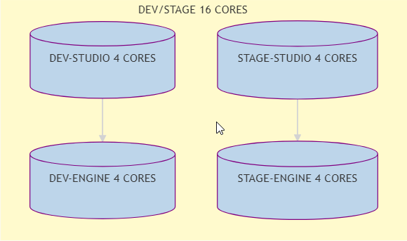
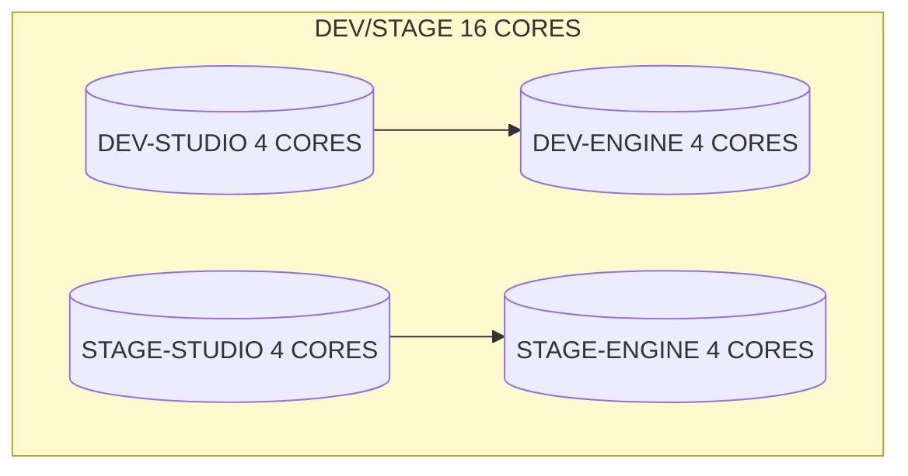
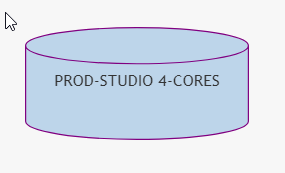
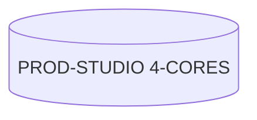
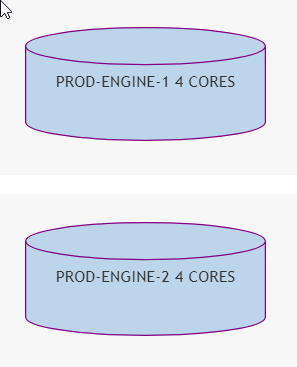
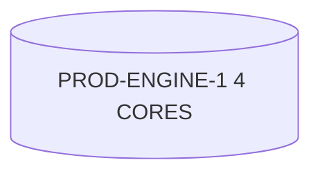
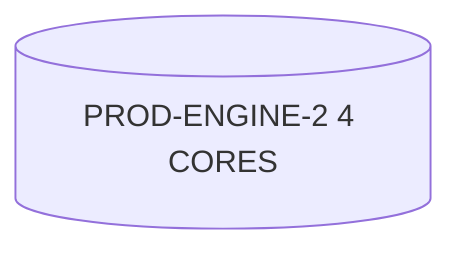

# CrafterCMS/ITD Architecture Docs
## Virtual Machine Layout

### Requirements for ALL VM's
Each ENV (DEV, STAGE, PROD) MUST have:

- SSH Connection to Managed Git Repos
- SSH Connection to Jenkins for Automation scripts
- SSH for STUDIO to DELIVERY Git Deployments
- SSO Authentication AD groups
- SSL/TLS Certificates

### DEV/STAGE 16 CORES
#### Networking
- SSO Endpoint - Internal-Only
- SSH Jenkins - Internal-Only
- GIT-SSH - OUT/IN - Github
#### Notes: 
- Supports BOTH DEV and STAGE environments.
- Ideally even though on the same machine, separating them into different Linux namespaces would be helpful for process isolation.
- They don't need to talk directly. Only via DevOps processes.
- SSH connections to managed GitHub Account

**Namespace Suggestions**
- *DEV-STUDIO
- *STAGE-STUDIO
- *DEV-DELIVERY
- *STAGE-DELIVERY

**NOTE** - The below code can be pasted into [Mermaid Live Editor](https://mermaid-js.github.io/mermaid-live-editor/) to be viewed or manipulated.

### PROD-STUDIO 4-CORES
#### Networking
- SSO Endpoint - IN
- SSH Jenkins - IN
- GIT-SSH - OUT/IN
#### Notes:
- Environment that will be public for regular use by department content authoring teams.
- This will be the environment that supports delivering content directly to production.

**NOTE** - The below code can be pasted into [Mermaid Live Editor](https://mermaid-js.github.io/mermaid-live-editor/) to be viewed or manipulated.

### PROD-ENGINEs 2 VM's (4 Cores Each) 8-CORES TOTAL
#### Networking
- Public-IP - OUT
- SSH Jenkins - IN
- GIT-SSH - To PROD-STUDIO
#### Notes:
- These two environments will be used to serve static files to a CDN
- Used as a GRAPHQL/REST Endpoint Server
- Serves as a Content Cache
- Serves Any kind of resource needed for production

**NOTE** - The below code can be pasted into [Mermaid Live Editor](https://mermaid-js.github.io/mermaid-live-editor/) to be viewed or manipulated.

